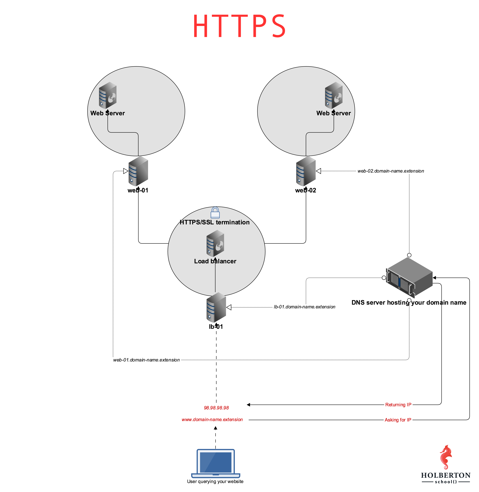

                            0x10. HTTPS SSL

This project aims to demonstrate the implementation of SSL termination using HAProxy on Ubuntu 16.04. SSL termination refers to the process of decrypting SSL-encrypted traffic at the load balancer (HAProxy), allowing it to inspect and route the traffic before forwarding it to the backend servers. This project specifically focuses on configuring HAProxy to accept encrypted traffic for the subdomain www, ensuring secure communication between clients and backend servers.

Project Overview
World Wide Web Configuration

The first task involves configuring the domain zone to point the subdomain www to the load balancer's IP address (lb-01). Additionally, subdomains lb-01, web-01, and web-02 are added to the domain zone.
A Bash script is created to display information about subdomains, accepting arguments for the domain and optional subdomain to audit.
HAProxy SSL Termination

The second task focuses on configuring HAProxy to handle SSL termination for the subdomain www. This involves:
Installing HAProxy version 1.5 or higher.
Generating SSL certificates for the domain/subdomain using Certbot.
Configuring HAProxy to listen on port 443, accept SSL traffic, and serve encrypted traffic.
Testing SSL termination to ensure secure communication between clients and backend servers.
