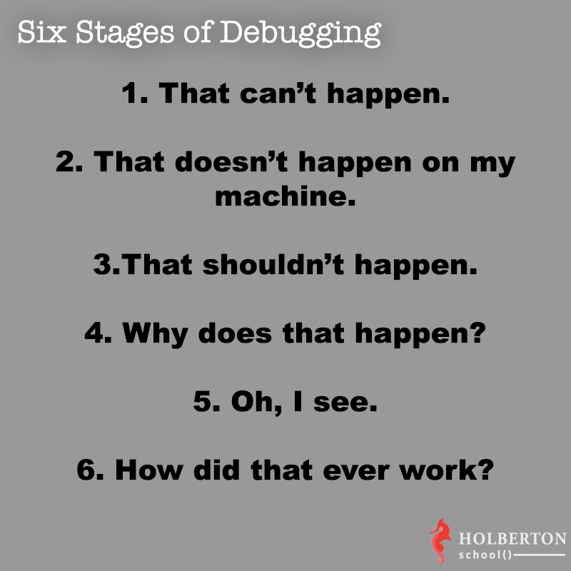

# 0x17. Web stack debugging #3




* When debugging, sometimes logs are not enough. Either because the software is breaking in a way that was not expected and the error is not being logged, or because logs are not providing enough information. In this case, you will need to go down the stack, the good news is that this is something Holberton students can do `:)`

* Wordpress is a very popular tool, it allows you to run blogs, portfolios, e-commerce and company websites… It actually powers 26% of the web, so there is a fair chance that you will end up working with it at some point in your career.

Wordpress is usually run on LAMP (Linux, Apache, MySQL, and PHP), which is a very widely used set of tools.

The web stack you are debugging today is a Wordpress website running on a LAMP stack.

## Overview

In this project I used ``tmux`` and ``strace`` command line tool to identify and fix the bug that was causing apache2 webserver to returng 500 when curl -sI localhost.
basically I used tmux to run two separate terminal  windows
in one terminal I identified the process id of apache2 webserver by using ```pidof apache2``` then I attached the pid to trace by ```trace -p <pid>```.
in another terminal window I run ``curl -sI localhost`` as expected the webserver gave me a 500 internal server error but this helped me identify the issue with trace (it was attached to the process) turned out there was a typo in wp-settings.php file. 
then I wrote a puppet manifest that fix the typo. 
