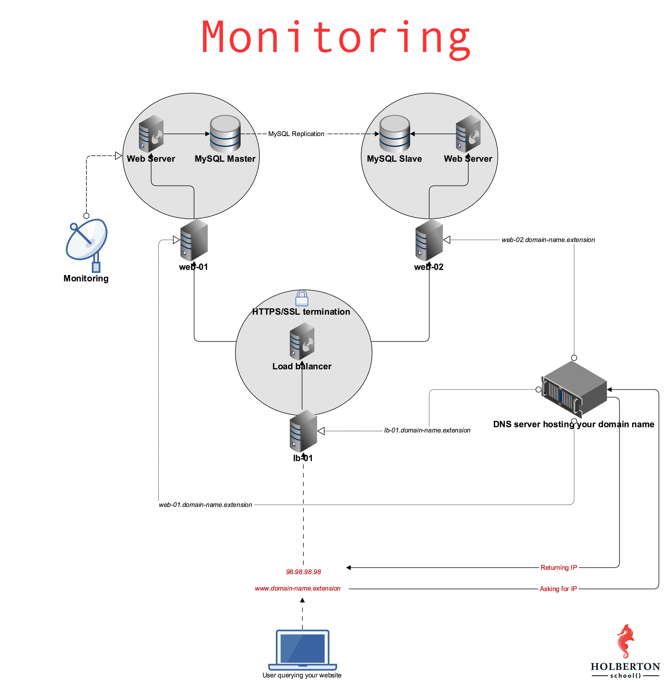

# 0x18. Webstack monitoring
## Background Context
* `You cannot fix or improve what you cannot measure` is a famous saying in the Tech industry. In the age of the data-ism, monitoring how our Software systems are doing is an important thing. In this project, we will implement one of many tools to measure what is going on our servers.

## Web stack monitoring can be broken down into 2 categories:

* Application monitoring: getting data about your running software and making sure it is behaving as expected
* Server monitoring: getting data about your virtual or physical server and making sure they are not overloaded (could be CPU, memory, disk or network overload)

### Overview
In this project I Signed up on [Datadog](https://www.datadoghq.com/) and installed datadog-agent on web-01 server

* I Monitored some metrics including : 
 
 >> Setting up a monitor that checks the number of read requests issued to the device per second.
   
 >> Setting up a monitor that checks the number of write requests issued to the device per second.

* I Created a new dashboard with 4 widgets of different types  and I monitored couple of metrics. after that
I used [DatadogAPI](https://api.datadoghq.com/api/v1/dashboard") to get my dashboard id.

